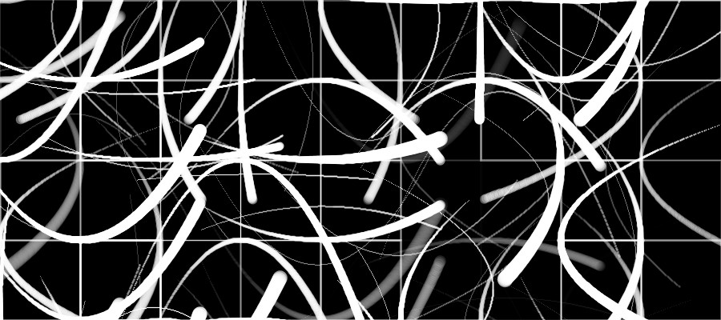
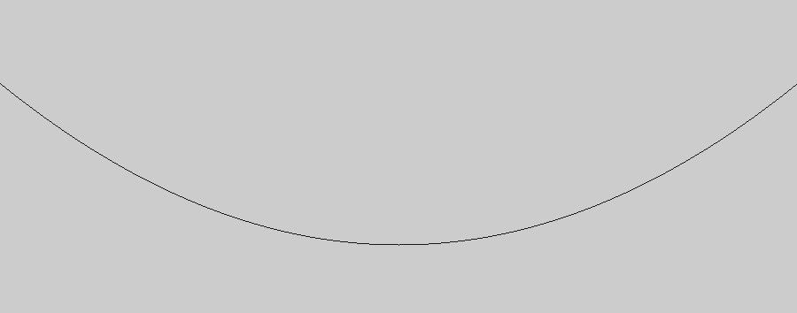

# quadratic-curves

Write-up and documentation of research on creating visual composition with using the concept of quadratic equations to create a visually pleasing graphic design.


Beta version of the artwork using my building blocks

## Painting curves with brushes
In one atelier-session we were painting curves with brushes.I was amazed how easily an algorithmic compomposition can be done between two indiviuals. Later on I tried to recreate the algorithm in form of a python script and failed to achive the goals. This repo is a collection of my attempts to understand what it takes.

#  Plotting a curve in processing



## Imagine the following program
```python
def setup() :
    # Create a 900x354 window
    size(900, 354)
    # Move the origin to the center
    translate(width * 0.5, height * 0.5)
    # Cover the width as range for x
    for x in range(int(-width*0.5), int(width*0.5)) :
        # The k-parameter affects the look of the graph
        k = -0.0009
        # Calculate a y component with a quadratic formula
        y = k * x * x
        # Draw the points to the window
        point(x, y)
    # Done with calculation and drawing
    save("out.jpg")
    exit()
```


There are many ways to create a curvy shape in Processing, but I was looking for one that enables me to store the points of a shape in a list. Therefore I didn't use the ``arc()`` method, nor the ``curveVertex()``so far. I went for the most basic approach and attempted a single quadratic curve program.
```python
for x in range(-r, r):
    y = k * x * x
    point(x, y)
```

## Expressing the curve is a main building block
It's been a while since I got introduced to quadratic curves in school, I had to freshen up my knowledge a bit. For the first sketch I work with the formula ``F(x) = k * x * x``where k is a value that influences the shape of the curve in my drawing. When k is a negative value the curve opens downwards, when k is a positive value the opposite. The curve also will flatten out to a straight line when k approaches ``Infinity``

## The formula written in code
I imagine a simple Processing sketch (in python mode) that saves an image with a fixed number points I want to plot.
```python
for x in range(-r, r):
    y = k * x * x
    point(x, y)
```
