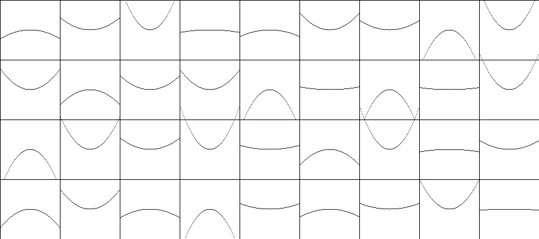

# quadratic-curves

Write-up and documentation my process for creating visual compositions using the concept of quadratic equations.


Beta version of the artwork

## A starting point - painting curves with brushes
In one atelier-session we were painting curves with brushes.I was amazed how easily an algorithmic compomposition can be done between two indiviuals. Later on I tried to recreate the algorithm in form of a python script and failed to achive the goals. This is a collection of my attempts to understand what it takes to create a visually interesting composition in the form of a python script.

# How to even get started?
## Starting small scale - with a single curve
There are many ways to create a curvy shape in Processing. You could look at the ``PShape`` object, the ``curveVertex()`` of a shape or the ``curveTightness()`` parameter. All those thing help you to create curves on the computer. What I was looking for was one that enables me to store the points of a shape in a list. This way I can, at a later time, compare two shapes with each other. I didn't use the ``arc()`` method nor the ``curveVertex()`` because of this reason. First I went for the most basic approach and attempted a single quadratic curve program.

- [x] Make a sketch that plots the points of a single curve
- [x] Pick one quadratic equasion and test values
- [x] Refactor to a function definition
- [x] Make a composition with multiple calls of that function

## Imagine the following program


An image of an upwards pointing quadratic curve plotted with code.

```python
"""
Saves an image of a single quadratic curve
"""

def setup() :

    # Create a 900x354 window
    size(900, 354)

    # Move the origin to the center
    translate(width * 0.5, height * 0.5)

    # Cover the width as range for x
    for x in range(int(-width*0.5), int(width*0.5)) :

        # The k-parameter affects the look of the graph
        k = -0.0009

        # Calculate a y component with a quadratic formula
        y = k * x * x

        # Draw the points to the window
        point(x, y)

    # Done with calculation and drawing
    save("out.jpg")

    exit()
```

## What I found out about that k parameter
It's been a while since I got introduced to quadratic curves in school, I had to freshen up my knowledge a bit. For the first sketch I work with the formula ``F(x) = k * x * x`` where k is a value that influences the shape of the curve in my drawing. When k is a negative value the curve opens upwards, when k is a positive value the downwards (in the processing coordinate system). The value of k affects how wide the curve opens and also will flatten out to a straight line when k approaches ``Infinity``.


Overlay of 10 different values of k between -0.1 and 0.1

```python
"""
Saves an image of multiple quadratic curves with the same origin
"""

def setup() :

    # Create a 900x354 window
    size(900, 354)

    # Move the origin to the center
    translate(width * 0.5, height * 0.5)

    # Draw multiple curves on top of each other
    for _ in range(10) :

        # Calculate a different k for each curve
        k = random(-0.01, 0.01)

        # Cover the width as range for x
        for x in range(int(-width*0.5), int(width*0.5)) :

            # The k-parameter affects the look of the graph


            # Calculate a y component with a quadratic formula
            y = k * x * x

            # Draw the points to the window
            point(x, y)

    # Done with calculation and drawing
    save("out.jpg")

    exit()
```

## Adding the "brush" effect and refactoring
Another building block of this composition is the effects that you get, when using a brush. I can only express these in a very abstract and simplified way in my computer program. I was trying to think of it this way: For every ``point(x, y)`` I create I assign a different ``strokeWeight(s)`` that I calculate from a mapping of my loop variable ``x``. What I get is a even gradient increase that I hacked in with various tricks (Code below).


A simulation of a brushed stroke

```python
"""
Saves an image of a single quadratic curve with a "brushed" look
"""

def setup() :

    # Create a 900x354 window
    size(900, 354)

    # Move the origin to the center
    translate(width * 0.5, height * 0.5)

    r = 200

    # Make a short curve
    for x in range(-r, r) :

        # The k-parameter affects the look
        k = -0.001

        # Calculate a y component
        y = k * x * x

        #
        # Simulating an even preassured brush stroke
        #

        # Map the loop variable to a value between -0.5 and 0.5
        s = map(x, -r, r, 1, 100)

        # Then take the absolute value of this to get only positive values
        s = abs(cos(s * s) * sqrt(s))

        # Assigning the effect to the stroke
        strokeWeight(s)

        # Draw the points to the window
        point(x, y)

    # Done with calculation and drawing
    save("out.jpg")

    exit()
```

## Adding a grid as a composition structure
I often work with a grid as a basic structure for a composition. I imagine the grid cells as unique elements that set a call to my curve function, each with different values

### Starting with a simple grid
To get a grid in ``u`` and ``v`` direction i use two nested for loops and a placeholder rectangle in the first go.


A grid of squares structures the image

```python
"""
Saves an image of a simple grid
"""
def setup() :

    # Create a window to draw in
    size(900, 400)

    # Define a varibale for the scaling
    s = 100

    # Loop in u and v direction
    for u in range(9):
        for v in range(4):
            rect(u * s, v * s, s, s)

    # Done with calculation and drawing
    save("out.jpg")
    exit()
```


### Adding the curve in each grid cell


Each cell spwans a curve with a different value for ``k``

```python
"""
Saves an image of a grid with a quadratic curve in each cell
"""
def setup() :

    # Create a window to draw in
    size(900, 400)

    # Loop in u and v direction
    for u in range(9):
        for v in range(4):
            # Draw the grid bounds with a rectangle
            rect(u * 100, v * 100, 100, 100)

            # Randomize the look of each curve
            k = random(-0.03, 0.03)

            for x in range(-50, 50) :
                # Calculate a y component
                y = k * x * x

                # Draw the points relative to the grid
                point(x + u * 100 + 50, y + v * 100 + 50)

    # Done with calculation and drawing
    save("out.jpg")
    exit()
```

### Adding the brush effect back in


A grid with a quadratic curve in each cell and the stroke effect applied

```python
"""
Saves an image of a grid with a quadratic curve in each cell and maps the stroke weight over time
"""
def setup() :

    # Create a window to draw in
    size(900, 400)

    # Loop in u and v direction
    for u in range(9):
        for v in range(4):
            # Prevent a slim grid
            strokeWeight(1)

            # Draw the grid bounds with a rectangle
            rect(u * 100, v * 100, 100, 100)

            # Randomize the look of each curve
            k = random(-0.03, 0.03)

            for x in range(-50, 50) :
                # Calculate a y component
                y = k * x * x

                # Map the loop variable to a value between -0.5 and 0.5
                s = map(x, -50, 50, 1, 100)

                # Then take the absolute value of this to get only positive values
                s = abs(cos(s * s) * sqrt(s))

                # Assigning the effect to the stroke
                strokeWeight(s)

                # Draw the points relative to the grid
                point(x + u * 100 + 50, y + v * 100 + 50)

    # Done with calculation and drawing
    save("out.jpg")
    exit()
```